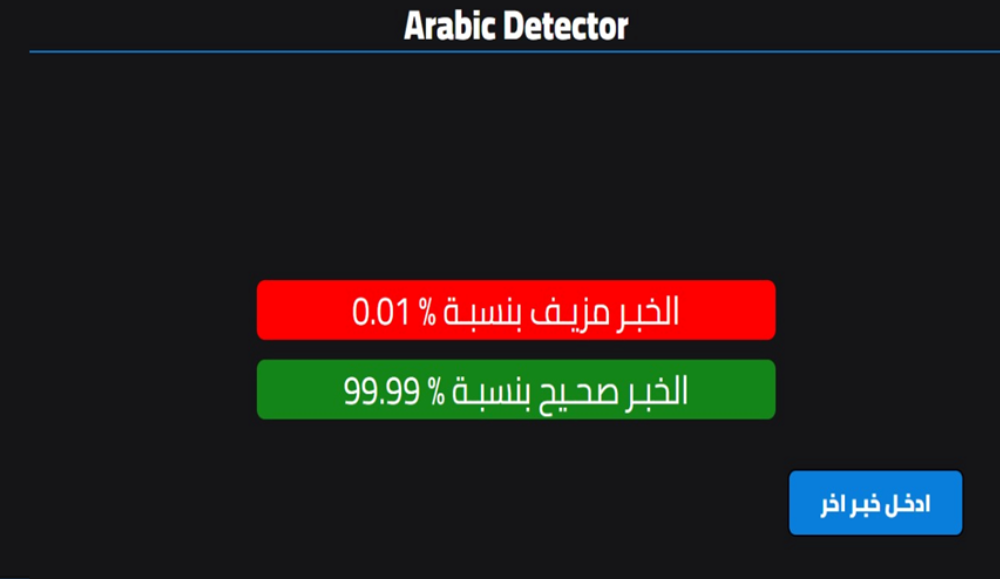

# Overview
AraNews is a comprehensive Arabic news dataset created to investigate misinformation and disinformation in Arabic news articles. The dataset includes diverse news sources from 15 Arab countries, the United States, and the United Kingdom, offering a broad perspective on the linguistic landscape.

### Project Description

This project centers on Arabic fake news detection, leveraging cutting-edge techniques such as Arabert pre-trained models from Hugging Face. The implementation also features the deployment of the model using Flask, complete with a user-friendly interface.

### Dataset Statistics

- Number of Newspapers: 50
- Countries Covered: 15 Arab countries, USA, UK
- Total News Articles: 5,187,957
Data Collection
The dataset was meticulously compiled by manually selecting 50 newspapers and subsequently scraping news articles from these sources.

### Code Structure

- `preprocessing.ipynb`: Houses the latest Arabic preprocessing techniques.
- `model_training.ipynb`: Code for training the fake news detection model.
- `deployment_flask.ipynb`: Flask application for model deployment.
## Results

The trained model achieved notable results:

- Training Loss (Epoch 2): 0.203500
- Validation Loss (Epoch 2): 0.228960
- Macro F1 (Epoch 2): 0.908546
- Accuracy (Epoch 2): 0.908658
### Model Save

The final model is saved in the `output_dir` directory, and the tokenizer used for preprocessing is also preserved for future use.

### Web Page

## Acknowledgments

Special appreciation to the authors of the AraNews dataset for providing a valuable resource for research in Arabic misinformation detection.

Arabic Fake News Detection
Arabic Fake News Detection is an innovative project designed to tackle the pervasive issue of misinformation in the Arabic language. Leveraging cutting-edge preprocessing techniques and state-of-the-art pre-trained models, particularly Arabert from Hugging Face, this project offers a robust solution for identifying and categorizing fake news in Arabic text.

Key Features
Advanced Arabic Preprocessing Techniques
Immerse yourself in the richness of Arabic language processing with a sophisticated preprocessing pipeline. This pipeline covers everything from handling tweets and emojis to normalizing Arabic text and performing effective stemming, ensuring meticulous preparation of data for robust analysis.

Arabert Pre-trained Models
Unleash the power of Arabert, pre-trained language models from Hugging Face. These models are specifically designed to understand the nuances and complexities of the Arabic language, enabling accurate and context-aware analysis.

Fake News Detection
Engage with machine learning models trained to discern between genuine and fake news in Arabic text. These models are equipped to identify patterns and features that distinguish trustworthy information from misinformation.

Flask Deployment with User Interface
Experience seamless interaction with the project through a user-friendly web interface powered by Flask. The deployment ensures accessibility, allowing users to input text and receive instant predictions on the authenticity of the provided information.

Project Components
Data Preprocessing
Dive into a comprehensive preprocessing pipeline that handles various aspects of text cleaning. This process ensures the removal of noise, irrelevant characters, and unnecessary elements. Specialized steps for tweet cleaning, emoji handling, and Arabic text normalization are included.

Arabert Model Integration
Embrace the capabilities of Arabert models for language understanding. The integration ensures that the models can harness the context and semantics of the Arabic language, contributing to more accurate and contextually aware analysis.

Fake News Classification
Explore the heart of the project, where machine learning techniques come into play to classify text as either genuine or fake. The models, having learned from diverse datasets, are adept at identifying linguistic cues and features indicative of misinformation.

Flask Web Application
Interact with the project effortlessly through a Flask-powered web application. Users can input text, receive predictions, and explore the project's capabilities in real-time. The user interface provides an intuitive experience for users of varying technical backgrounds.

Usage Instructions
Clone the Repository:
Begin your journey by cloning the repository to your local environment.

Install Dependencies:
Follow the provided instructions to install the necessary dependencies. Ensure that you have the required libraries and frameworks to run the project seamlessly.

Run the Flask Application:
Launch the Flask application locally to experience the project firsthand. Alternatively, deploy it to a server for broader accessibility.

Contribution Guidelines
Contributions are enthusiastically welcomed! If you have ideas for enhancements, novel features, or improvements, please refer to the contribution guidelines in the repository. Your contributions can play a pivotal role in advancing the capabilities of this project.

## Acknowledgments

Special appreciation to the authors of the AraNews dataset for providing a valuable resource for research in Arabic misinformation detection.

**Dataset Citation:**
- **Title:** Machine Generation and Detection of Arabic Manipulated and Fake News
- **Authors:** El Moatez Billah Nagoudi, AbdelRahim Elmadany, Muhammad Abdul-Mageed, Tariq Alhindi, Hasan Cavusoglu
- **Year:** 2020
- **Book Title:** Proceedings of the Fourth Arabic Natural Language Processing Workshop
- **Address:** Barcelona, Spain

# Download the dataset 
  https://github.com/UBC-NLP/wanlp2020_arabic_fake_news_detection?tab=readme-ov-file#donwload-aranews
